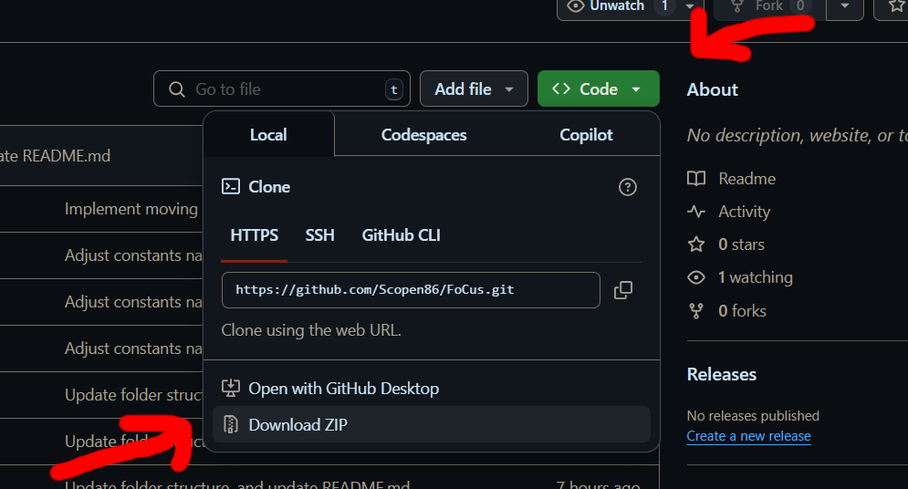
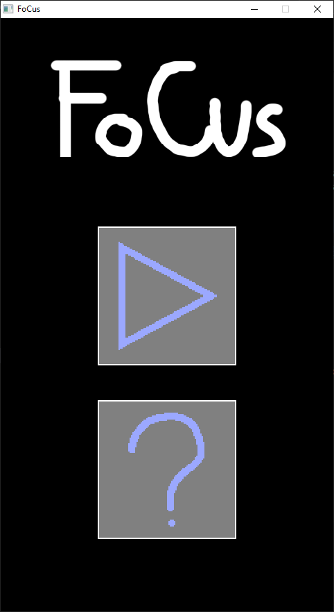
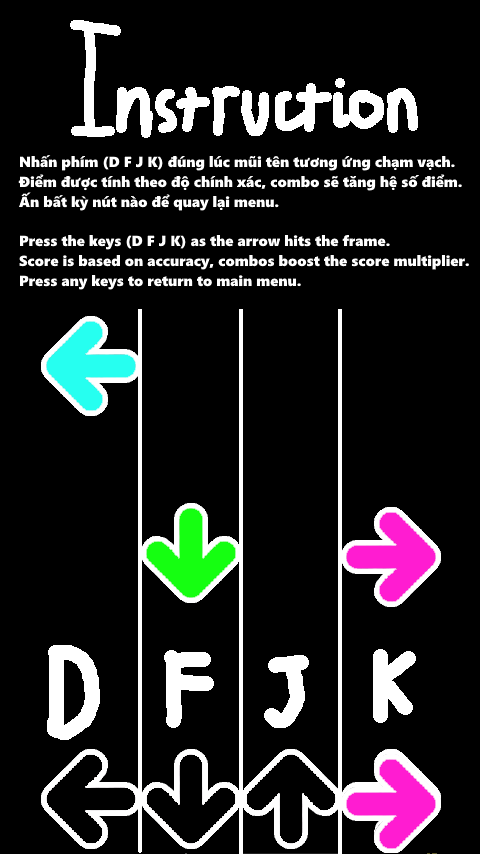
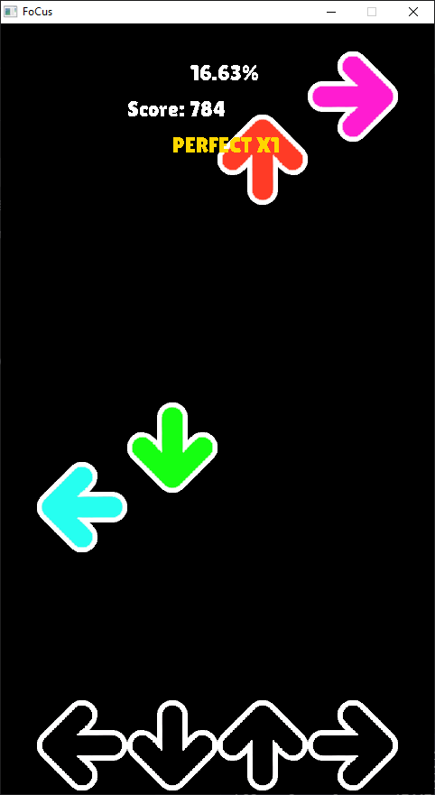
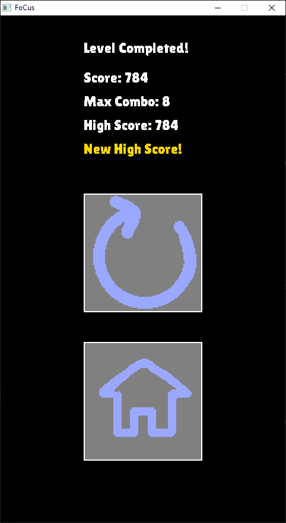

# **FoCus - README**  
### Môn học: Lập trình nâng cao (INT2215_2 2425)

---

## **Thông tin cá nhân**

- **Họ và tên:** Nguyễn Ngọc Quý - K69I-IT2  
- **Mã sinh viên:** 24020290  
- **Bài tập lớn:** FoCus - Một trò chơi nhịp điệu lấy cảm hứng từ *Osu! Mania* và *Friday Night Funkin'*

---

## **Giới thiệu**

**FoCus** là một trò chơi nhịp điệu. Nhiệm vụ của người chơi là hoàn thành bản nhạc với số điểm cao nhất bằng cách nhấn các phím theo đúng nhịp điệu và thời điểm.  

---

## **Mục lục**

- [0. Cách tải game](#0-cách-tải-game)  
  - [a. Cách 1: Không bao gồm mã nguồn](#a-cách-1-không-bao-gồm-mã-nguồn)  
  - [b. Cách 2: Bao gồm mã nguồn và có thể biên dịch](#b-cách-2-bao-gồm-mã-nguồn-và-có-thể-biên-dịch)  
- [1. Bắt đầu game](#1-bắt-đầu-game)  
- [2. Cách chơi](#2-cách-chơi)  
- [3. Kết thúc level](#3-kết-thúc-level)  
- [4. Source code](#4-source-code)  
- [5. Credits](#5-credits)  

---

## 0. Cách tải game

### a. Cách 1: Không bao gồm mã nguồn

- Tải bản `.zip` tại: [FoCus Release](https://github.com/Scopen86/FoCus/releases/tag/published)  
- Cách này tiết kiệm thời gian và dung lượng tải.  
- Sau khi tải, giải nén và chạy `FoCus.exe` để chơi.  

### b. Cách 2: Bao gồm mã nguồn và có thể biên dịch

#### **Bước 1:** Clone repo về máy  
- Sử dụng lệnh:  
  ```
  git clone https://github.com/Scopen86/FoCus.git
  ```
  hoặc chọn **Code → Download ZIP**



> Mã nguồn nằm trong thư mục `src/`, file header trong `include/`

#### **Bước 2:** Cài đặt MinGW và GNU Make

- Có thể cài bằng nhiều cách, mình sẽ cài qua [Chocolatey](https://chocolatey.org/install):

```
choco install mingw -y
choco install make -y
```

#### **Bước 3:** Compile game sử dụng make:

- Đảm bảo thư viện SDL2 và các extension sau ở thư mục gốc gốc ổ C:
  - C:\SDL2-w64, C:\SDL2_image-w64, C:\SDL2_TTF-w64, C:\SDL2_Mixer-w64

- Trong đó:
  - C:\SDL2-w64\include\SDL2: chứa các file .h
  - C:\SDL2-w64\lib: chứa các file .a / .la
  
  - Tương tự cho các thư viện SDL2_image, SDL2_ttf, và SDL2_mixer

- Sau đó chạy lệnh sau trong terminal

```
make
```

#### **Bước 4:** Chạy file `FoCus.exe` để bắt đầu chơi.

---

## 1. Bắt đầu game

- Chờ game khởi động, sau đó click vào nút **Bắt đầu** (icon) để vào trò chơi.



---

## 2. Cách chơi

- Sử dụng các phím **D, F, J, K** khi mũi tên rơi chạm đúng vạch ngang.  
- Điểm được tính dựa trên độ chính xác.  
- **Combo** sẽ làm tăng hệ số điểm.




---

## 3. Kết thúc level

- Game hiển thị kết quả: tổng điểm, high score, và combo cao nhất đạt được.  
- Bạn có thể chọn chơi lại hoặc quay lại menu chính.



---

## 4. Source Code

### Thư mục chính:

- `src/`: Mã nguồn chính  
  - `game.cpp` / `game.hpp`: Logic tổng thể và `main()`  
  - `menu.cpp` / `menu.hpp`: Xử lý các menu  
  - `logic.cpp` / `logic.hpp`: Tính điểm, combo, va chạm  
  - `audio.cpp` / `audio.hpp`: Xử lý âm thanh  
  - `timer.cpp` / `timer.hpp`: Quản lý thời gian  
  - `renderwindow.cpp` / `renderwindow.hpp`: Render đối tượng & text  
  - `entity.hpp`: Định nghĩa các đối tượng game (target, khung,...)

- `include/`: Chứa các file header dùng chung

- `res/`: Tài nguyên game  
  - `textures/`: Hình ảnh đối tượng  
  - `level/`: Dữ liệu level (`targetTimings.txt`, `userScore.txt`, nhạc nền,...)

### Kỹ thuật sử dụng:

- SDL2.0, SDL_Image, SDL_TTF, SDL_Mixer  
- Di chuyển đối tượng bằng `deltaTime` (không phụ thuộc FPS)  
- Sử dụng class, vector, overloading,...  
- Ghi/đọc file: lưu điểm cao, đọc level
- Hệ thống menu linh hoạt
- Render hiệu quả hình ảnh, văn bản, và âm thanh

---

## 5. Credits

- Cách quản lý thư mục, cài đặt SDL2 và makefile và một vài phần của các class RenderWindow, Entity, Vector2f trên [tutorial kênh Youtube codergopher](https://www.youtube.com/watch?v=KsG6dJlLBDw&list=PL2RPjWnJduNmXHRYwdtublIPdlqocBoLS)

- Hình ảnh: Texture game được tạo trên Paint.NET
- Dựa trên cảm hứng từ: Osu! Mania, Friday Night Funkin  
- Âm nhạc: [Nighthawk22 - Isolation (Official LIMBO Remix)](https://www.youtube.com/watch?v=lNjVd00zKDE)

- File README.md dựa trên: https://github.com/nmhienbn/PVZ-Kaito-NMH-Edition/blob/main/README.md
